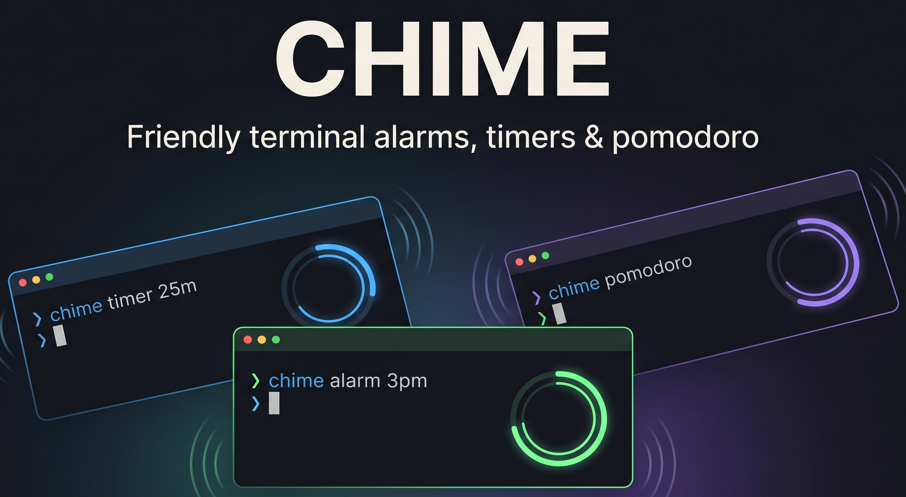

<p align="center">
  
</p>

<p align="center">
  <a href="https://github.com/MaVericKWareZ/chime/actions/workflows/ci.yml"></a>
  <a href="https://pypi.org/project/chime-cli/"></a>
  <a href="https://pypi.org/project/chime-cli/"></a>
  <a href="LICENSE"></a>
</p>

A no-fuss CLI for the things you actually use timers for: a quick countdown, an alarm at 3pm, and pomodoro rounds when you need to focus. Zero runtime dependencies — just the Python standard library.

```text
$ chime 10m "tea is ready"
⏳  tea is ready
  target 16:42:11  ·  10m from now
  Ctrl-C to cancel

  09:58
```

## Features

- Countdown timers with natural durations (`10m`, `1h30m`, `90s`, `0.5h`)
- Clock-time alarms (`at 9am`, `at 15:30`, `at "tomorrow 9am"`)
- Timezone-aware alarms (`at "9am EDT"`, `--tz Asia/Kolkata`) with a default configurable per user
- Pomodoro mode — configurable work / break / rounds
- Stopwatch (count-up)
- Background alarms (`--bg`) that survive shell exit, with `list` / `cancel`
- Native desktop notifications + system sounds on macOS, Linux, and Windows
- Optional spoken alerts (`--say`)
- Zero runtime dependencies — just the Python standard library

## Install

**Homebrew (macOS / Linux):**

```bash
brew install MaVericKWareZ/tap/chime
```

**pipx (cross-platform, recommended for Windows):**

```bash
pipx install chime-cli
# or
pip install --user chime-cli
```

**From source:**

```bash
git clone https://github.com/MaVericKWareZ/chime
cd chime
pipx install .
```

Any of these puts a `chime` command on your PATH.

## Usage

| Command | What it does |
| --- | --- |
| `chime 10m "tea"` | Countdown timer (foreground) |
| `chime 1h30m` | Same, longer |
| `chime --bg 25m focus` | Set alarm in background, get your prompt back |
| `chime at 9:30am standup` | Alarm at clock time |
| `chime at 15:30 "pick up package"` | 24h clock |
| `chime at "tomorrow 9am"` | Skip ahead one day |
| `chime at "9am EDT" standup` | Alarm in a source timezone (inline) |
| `chime at 9am --tz Asia/Kolkata` | Same, via the `--tz` flag |
| `chime config set timezone Asia/Kolkata` | Set your default timezone |
| `chime config` | Show effective timezone config |
| `chime pomodoro` | 25/5 × 4 rounds (defaults) |
| `chime pomodoro 50 10 3` | 50m work / 10m break × 3 rounds |
| `chime stopwatch` | Count-up timer |
| `chime list` | Show active background alarms |
| `chime cancel 1234` | Cancel one (by id from `chime list`) |
| `chime cancel all` | Cancel everything |
| `chime sounds` | List available alarm sounds |
| `chime sounds Hero` | Preview a sound |
| `chime help` | Full help |

### Options

Available on any alarm-setting command, in any position:

- `--bg` — run in background, return immediately
- `--sound NAME` — use a different alert sound (`chime sounds` to list)
- `--repeat N` — repeat the alert sound N times (default 3)
- `--tz ZONE` — source timezone for the alarm (`EDT`, `Asia/Kolkata`, …); see [Timezones](#timezones). Can't be combined with an inline timezone
- `--say` — speak the message aloud (uses `say` on macOS, `spd-say` / `espeak` on Linux, PowerShell SAPI on Windows)
- `--no-sound` — silent (desktop notification only)

### Duration formats

`10m`, `1h30m`, `90s`, `0.5h`, `45m30s`, `1d`. A bare number is minutes: `chime 30` = 30 min.

### Time formats

`15:30`, `3:30pm`, `9am`, `9:00`, `tomorrow 9am`. Past clock times automatically roll to tomorrow.

## Timezones

By default an alarm fires at the requested wall-clock time in your **system timezone**. You can pin an alarm to a different **source timezone** two ways:

```bash
chime at "9am EDT" standup       # inline, in the time string
chime at 9am --tz Asia/Kolkata   # via the --tz flag
```

Use one or the other — supplying both an inline timezone and `--tz` is an error.

**Accepted abbreviations.** Unambiguous abbreviations resolve as **zone aliases** to a single IANA zone, and full IANA names (`Asia/Kolkata`, `Europe/London`) always work:

| Abbreviation | Zone |
| --- | --- |
| `EST` / `EDT` | `America/New_York` |
| `CDT` | `America/Chicago` |
| `MST` / `MDT` | `America/Denver` |
| `PST` / `PDT` | `America/Los_Angeles` |
| `JST` | `Asia/Tokyo` |
| `KST` | `Asia/Seoul` |
| `AEST` / `AEDT` | `Australia/Sydney` |
| `GMT` / `UTC` | `UTC` |

An abbreviation names the *zone*, not a fixed offset: `EST` and `EDT` both mean New York time, and DST is applied by `zoneinfo` for the target moment — you don't have to know which season you're in. (For a literal fixed offset, use an IANA form like `Etc/GMT+5`.)

**Rejected abbreviations.** Ambiguous abbreviations map to more than one region, so Chime refuses to guess and errors with the candidates — supply the IANA name instead:

| Abbreviation | Could mean |
| --- | --- |
| `IST` | `Asia/Kolkata`, `Europe/Dublin`, `Asia/Jerusalem` |
| `CST` | `America/Chicago`, `Asia/Shanghai`, `America/Havana` |
| `BST` | `Europe/London`, `Asia/Dhaka`, `Pacific/Bougainville` |
| `AST` | `America/Halifax`, `Asia/Riyadh` |

Note `CST` errors even though `CDT` resolves cleanly — the daylight form happens to be unambiguous while the standard form isn't.

**A configured default.** Set a timezone once and every bare `chime at` uses it:

```bash
chime config set timezone Asia/Kolkata
```

Abbreviations are resolved to their IANA name when you set them (`chime config set timezone EDT` stores `America/New_York` and echoes back the typed form). The **effective timezone** for any command is resolved in order: inline timezone → `--tz` → configured default → system timezone.

`chime config` shows the current setting; `chime config get timezone` prints just the value (script-friendly); `chime config unset timezone` clears it; `chime config reset` wipes the whole config.

**Config file.** Settings live in a single JSON file:

- **POSIX (macOS / Linux):** `$XDG_CONFIG_HOME/chime/config.json` (defaults to `~/.config/chime/config.json`).
- **Windows:** `%APPDATA%\chime\config.json`.

## Platform support

| Platform | Notifications | Sound | Speech |
| --- | --- | --- | --- |
| macOS | `osascript` | `afplay` + system sounds | `say` |
| Linux | `notify-send` (libnotify) | `paplay` / `aplay` | `spd-say` / `espeak` |
| Windows | PowerShell toast (Win 10+) | `winsound` (stdlib) | PowerShell SAPI |

Linux users typically already have these tools; on a fresh system: `sudo apt install libnotify-bin pulseaudio-utils` (Debian / Ubuntu) gets you notifications + sound.

## Background alarms

When you use `--bg`, chime detaches from your shell — you can close the terminal and the alarm still fires.

- **POSIX (macOS / Linux):** double-fork + `setsid`. State at `$XDG_STATE_HOME/chime/alarms.json` (defaults to `~/.local/state/chime/alarms.json`).
- **Windows:** `subprocess.Popen` with `DETACHED_PROCESS` flags. State at `%LOCALAPPDATA%\chime\alarms.json`.

For an alarm set in a non-local source timezone, `chime list` appends the source wall-clock and label in parens (e.g. `Fri 18:30:00 … (09:00 EDT)`) so you can audit what you scheduled.

Stale entries from killed processes are pruned automatically the next time you run `chime list` or `chime cancel`.

## Development

```bash
git clone https://github.com/MaVericKWareZ/chime
cd chime
python -m venv .venv && source .venv/bin/activate
make install      # editable install + dev deps + pre-commit hooks
make help         # discover every dev / build / release target
```

`make test`, `make lint`, `make fmt`, `make build` are the common ones. See [CONTRIBUTING.md](CONTRIBUTING.md) for the contributor guide and the release process.

## Links

- [Changelog](CHANGELOG.md) — what changed, version by version
- [Contributing](CONTRIBUTING.md) — dev setup, code style, release flow
- [Security policy](SECURITY.md) — how to report a vulnerability
- [Issue tracker](https://github.com/MaVericKWareZ/chime/issues)

## License

[MIT](LICENSE) © Sarthak Mahapatra
